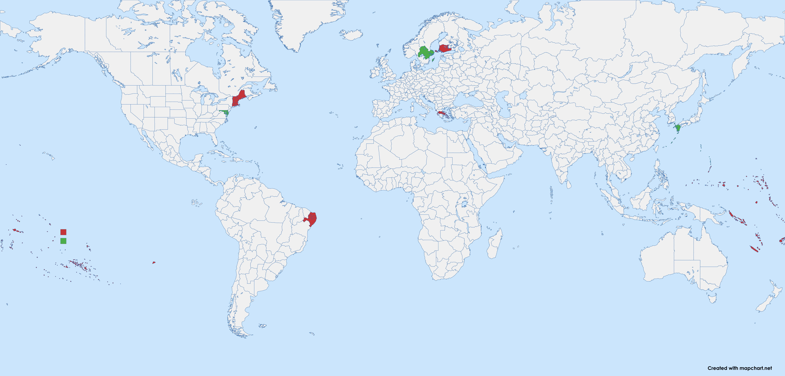

# Victoria 3 States Merging Mod (Minimal Version)

[简体中文](README_zh-CN.md)

- If you prefer to merge more states, please check out the full version of this mod on:
  - [Github](https://github.com/ShabbyGayBar/StateMerging), or
  - [Steam Workshop](https://steamcommunity.com/sharedfiles/filedetails/?id=3254683348).
- If you prefer to make your own states merging mod, please check out the [State Merger](https://github.com/ShabbyGayBar/StateMerger).

Pretty self-explanatory mod name. This mod combines multiple states in the game Victoria 3 together while keeping the overall pop & buildings unchanged.

Barracks & naval base cap as well as taxation which were reduced due to less number of states will be compensated (partially) by granting state buffs.

Speaking of buffs, they were given according to how many vanilla states they merged, except several ultra-minor states that don't deserve being a state at all (no offense).

Merged states WILL LOSE THEIR CITY & BUILDING MODELS.

Merged states WILL LOSE THEIR STATE ID, which may cause problems with certain journal entries and such. please report issues when you encounter them.

## How to install

- Subscribe to the mod on [Steam Workshop](https://steamcommunity.com/sharedfiles/filedetails/?id=3432100126).
or
- Download the mod zip file and extract it to your Victoria 3 mod folder (typically located at `Documents\Paradox Interactive\Victoria 3\mod`).

## Which states will be merged

Please refer to [merge_states.json](merge_states.json) for all the changes in states.

The keys of the json are the state id of the existing states in the mod, and the values are lists of state ids in vanilla game that will be merged into the key state.

## Feedback

### Bug Reports

Please report any bugs you encounter in the Issues tab using the bug report template.

### Feature Requests

If you have other ideas for state merging, you could modify the [merge_states.json](merge_states.json) file ("json" for short), or draw a map of the states you want to merge on [mapchart](https://www.mapchart.net/victoria-3.html) ("map" for short).

There are multiple ways to give suggestions on the state merging plan, the following ways are sorted by recommendation:

- Submit an issue in the Issues tab with the feature request template. In the issue, you could provide either the json file or the map.
- Post the map you draw on my [paradox forum post](https://forum.paradoxplaza.com/forum/threads/brainstorm-tell-us-about-your-ideal-state-merging-plan.1726629/) .
- Post the map you draw on my [tieba post](https://tieba.baidu.com/p/9433803383?) .
- Leave a comment on the Steam Workshop page.

## Compatability

Incompatible with anything that modifies
- game\common\history\buildings\
- game\common\history\pops\
- game\common\history\states\
- game\map_data\state_regions\

Other modified files that doesn't affect gameplay as much

- game\common\ai_strategies
- game\common\character_templates
- game\common\company_types
- game\common\country_definitions
- game\common\country_formation
- game\common\decisions
- game\common\dynamic_country_names
- game\common\flag_definitions
- game\common\history\global
- game\common\journal_entries
- game\common\on_actions
- game\common\scripted_buttons
- game\common\scripted_effects
- game\common\scripted_triggers
- game\events
- game\localization

## Acknowledgments

Special thanks to user [思考的肾结核](https://steamcommunity.com/profiles/76561198104682926) who wrote the [original version](https://steamcommunity.com/sharedfiles/filedetails/?id=3254683348) of this mod.

## License

This mod is under [MIT LICENSE](LICENSE).
