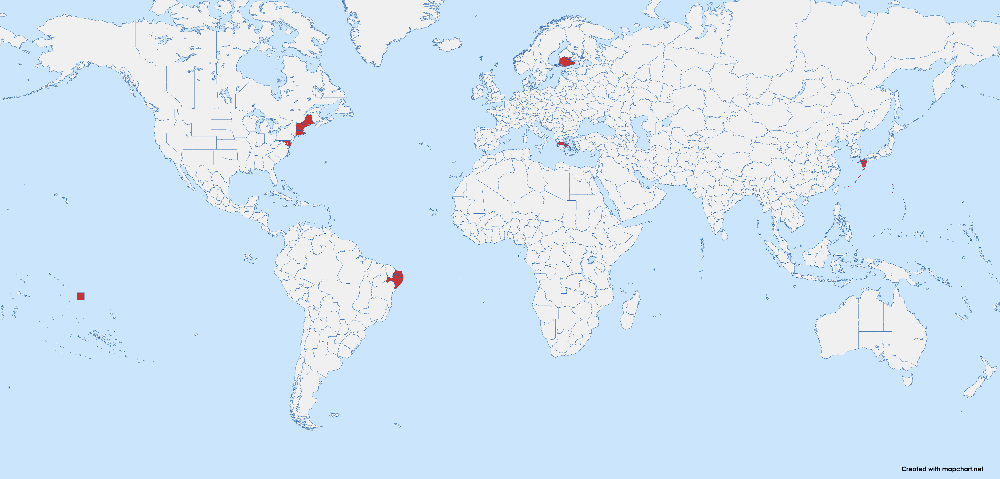

# 维多利亚3省份合并

一个省份合并 Mod，合并了部分地区。

建筑、人口等数据都保留原样。但是因为合并了各个州，所以整体陆军、海军、征税等加成在州上的数值上限都减少了，所以通过加 buff 的方式弥补了一部分回来。

因技术力有限，被合并的州的城市、建筑模型都会消失。

被合并的州的代码会消失，可能会导致部分日志和事件无法触发或完成，如有此 BUG 请在 Issues 中提出。 

另外，buff 是按被合并的州的数量给的，但是因为有些州实在太小了，我认为它们本来就不应该算一个州，所以给 buff 时没有计入。

## 安装方法

- 在 [Steam 创意工坊](https://steamcommunity.com/sharedfiles/filedetails/?id=3371693463) 订阅本 Mod。
或者
- 下载 Mod 的 zip 文件并解压到维多利亚3的 Mod 文件夹中（通常位于 `Documents\Pardox Interactive\Victoria 3\mod`）。

## 合并标准：

以下标准按照重要性排序：

- **地块数目**
  - 任何地块数目小于 10 的州都会被合并。
  - 地块数目在 10-20 之间的州，如果没有后面因素的支撑，大概率会被合并。
  - 地块数目小于 5 的州被合并时不会被计入 buff。

- **历史渊源和文化**
  - 今天分属不同国家的省份不会被合并，除非满足上面提到的条件。
  - 文化本土特质相同的省份更有倾向被合并。

- **美观度**

### 当前已经合并的省份

### 未来将要合并的省份

## 提交反馈

### BUG 反馈

请在 Issues 中使用 bug report 模板报告您遇到的任何错误。

### 功能请求

如果您对省份合并有其他想法，您可以修改 [merge_states.json](merge_states.json) 文件（下文简称为 "json"），或在 [mapchart](https://www.mapchart.net/victoria-3.html) 上绘制您想要合并的省份地图（下文简称为 "地图"）。

有多种方式可以提出关于省份合并计划的建议，以下方式按推荐程度排序：

- 在 Issues 中提交 feature request。在问题中，您可以提供 json 文件或地图。
- 在我的 [paradox 论坛帖子](https://forum.paradoxplaza.com/forum/threads/brainstorm-tell-us-about-your-ideal-state-merging-plan.1726629/) 上发布您绘制的地图。
- 在我的 [贴吧帖子](https://tieba.baidu.com/p/9433803383?) 上发布您绘制的地图。
- 在 Steam 创意工坊页面上留言。

## 改动说明

所有对省份的改动请参照 [merge_states.json](merge_states.json)。

其中，每个键代表了 Mod 中存在的省份代码，对应的值代表了要合并到这个省份的原版省份代码。

## 兼容性：

跟任何修改了
- game\common\history\buildings\
- game\common\history\pops\
- game\common\history\states\
- game\map_data\state_regions\

下的文件的Mod都不兼容

其他对游戏进程影响较小的文件的改动

- game\common\ai_strategies
- game\common\character_templates
- game\common\company_types
- game\common\country_definitions
- game\common\country_formation
- game\common\decisions
- game\common\dynamic_country_names
- game\common\flag_definitions
- game\common\history\global
- game\common\journal_entries
- game\common\on_actions
- game\common\scripted_buttons
- game\common\scripted_effects
- game\common\scripted_triggers
- game\events
- game\localization

## 致谢

* 感谢原作者 [思考的肾结核](https://steamcommunity.com/profiles/76561198104682926) 制作的最初版本 [省份合并 Mod](https://steamcommunity.com/sharedfiles/filedetails/?id=3254683348)。

## 软件许可证

本 Mod 使用 [MIT LICENSE](LICENSE) 授权。
