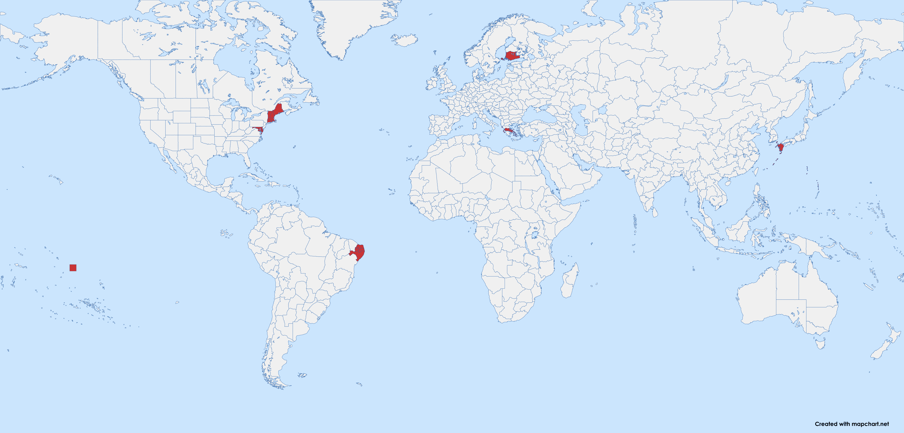

# 维多利亚3省份合并

一个省份合并模组，合并了部分地区。

建筑、人口等数据都保留原样。但是因为合并了各个省份，所以整体陆军、海军、征税等加成在省份上的数值上限都减少了，所以通过加 buff 的方式弥补了一部分回来。

因技术力有限，被合并的省份的城市、建筑模型都会消失。

被合并的省份的代码会消失，可能会导致部分日志和事件无法触发或完成，如有此 BUG 请在 Issues 中提出。 

另外，buff 是按被合并的省份的数量给的，但是因为有些省份实在太小了，我认为它们本来就不应该算一个省份，所以给 buff 时没有计入。

## 当前已经合并的省份

所有对省份的改动请参照 [merge_states.json](../merge_states.json)。

其中，每个键代表了模组中存在的省份代码，对应的值代表了要合并到这个省份的原版省份代码。

## 安装方法

- 在 [Steam 创意工坊](https://steamcommunity.com/sharedfiles/filedetails/?id=3432100126) 订阅本模组。
或者
- 在 [Paradox 官网](https://mods.paradoxplaza.com/mods/113894/Any) 下载本模组。
或者
- 下载模组的 zip 文件并解压到维多利亚3的模组文件夹中（通常位于 `Documents\Pardox Interactive\Victoria 3\mod`）。

## 提交反馈

如果您有任何反馈，请参考本模组的[完整版](https://github.com/ShabbyGayBar/StateMerging)的 issue 板块。

## 兼容性：

跟任何修改了
- game\common\history\buildings\
- game\common\history\pops\
- game\common\history\states\
- game\map_data\state_regions\

下的文件的模组都不兼容

其他对游戏进程影响较小的文件的改动

- game\common\ai_strategies
- game\common\character_templates
- game\common\company_types
- game\common\country_definitions
- game\common\country_formation
- game\common\decisions
- game\common\dynamic_country_names
- game\common\flag_definitions
- game\common\history\global
- game\common\journal_entries
- game\common\on_actions
- game\common\scripted_buttons
- game\common\scripted_effects
- game\common\scripted_triggers
- game\events
- game\localization\LANGUANGE\map

## 相关链接

- 如果您希望合并更多省份，您可以选择使用本模组的完整版：
  - [Github](https://github.com/ShabbyGayBar/StateMerging), 或
  - [Steam 创意工坊](https://steamcommunity.com/sharedfiles/filedetails/?id=3371693463), 或
  - [Paradox 官网](https://mods.paradoxplaza.com/mods/120868/Any).
- 如果您希望制作自己的省份合并模组，您可以使用[省份合并自动化脚本及教程](https://github.com/ShabbyGayBar/StateMerger).

## 致谢

* 感谢原作者 [思考的肾结核](https://steamcommunity.com/profiles/76561198104682926) 制作的最初版本 [省份合并模组](https://steamcommunity.com/sharedfiles/filedetails/?id=3254683348)。

## 软件许可证

本模组使用 [MIT LICENSE](../LICENSE) 授权。
